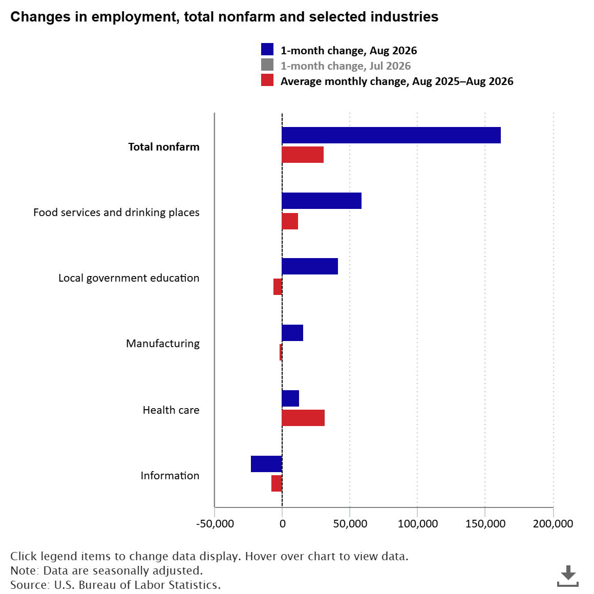

# ExoRisk: Isolating Sector Delta Risk in Consumer Credit

**Architect:** Hon Seng Choi | Principal Quantitative Architect
**Domain:** Macroeconomic Stress-Testing & Predictive Underwriting

* **Live Production Engine:** [https://exorisk-credit-pricing-engine.streamlit.app/](https://exorisk-credit-pricing-engine.streamlit.app/)
* **Repository & Architecture:** [https://github.com/honsengchoi1/ExoRisk-PD-Engine](https://github.com/honsengchoi1/ExoRisk-PD-Engine)

---

## 1. The Macroeconomic Thesis: The Trajectory vs. Snapshot Problem
Traditional consumer credit models rely heavily on idiosyncratic micro-features (FICO, DTI, Income). However, this static approach creates a massive blind spot during economic regime shifts. 

The August 2026 Nonfarm Payrolls (NFP) report exposed a severe divergence in the labor market: while Government and Healthcare sectors added jobs, the Information and Technology sectors experienced distinct contractions. A static underwriting model treats a $100k-earning Tech worker and a $100k-earning Healthcare worker as identical risks. **ExoRisk was engineered to mathematically separate them.**

**The Day-1 Pricing Constraint:** A critical challenge in predictive underwriting is the time delay between these macroeconomic shifts and actual loan defaults. An underwriter cannot wait six months to see if a borrower actually loses their job; risk must be priced accurately on Day 1. To solve this, ExoRisk does not rely on static monthly job counts. Instead, the pipeline computes **1-month, 3-month, and 6-month rolling NFP momentum vectors** for 14 distinct employment sectors. 

By merging this historical macroeconomic trajectory with micro-level borrower tapes, the XGBoost engine learns to use sector momentum as a leading indicator of future failure, dynamically adjusting the Probability of Default (PD) based on the exact economic environment at the moment of origination.

<i>Exhibit 1: August 2026 NFP Sector Divergence (Source: U.S. Bureau of Labor Statistics)</i>

## 2. Architectural Anchor: The 2-Year Treasury Yield
Ingesting multiple highly correlated macroeconomic indicators (such as CPI, GDP, and Unemployment) simultaneously degrades feature attribution and destabilizes SHAP interpretability.

To maintain strict SR 11-7 compliance, ExoRisk designates the 2-Year US Treasury Yield as its singular systemic macro proxy. Because the 2-Year note natively prices in federal monetary policy, geopolitical shocks, and global market volatility, it acts as an ultimate aggregator of baseline economic risk.

By anchoring the systemic environment to this single metric, the gradient-boosted engine is freed to cleanly isolate the precise, sector-specific job momentum impacting the borrower without introducing algorithmic confusion.

<i>Exhibit 2: Macro ETL Architecture - Demonstrating the vectorized multi-index parquet assembly</i>

## 3. Algorithmic Explainability & SHAP Discoveries
To satisfy SR 11-7 Model Risk Management (MRM) requirements, the black-box gradient boosting architecture was audited using Shapley Additive Explanations (TreeSHAP). The results validated the core macroeconomic thesis and revealed several latent credit dynamics.

**Key SHAP Findings:**
1.  **The Baseline vs. Marginal Adjustment:** The SHAP hierarchy confirms that idiosyncratic micro-factors (Interest Rate, FICO, Loan Amount) correctly establish the global baseline risk. The NFP sector deltas sit lower in the hierarchy because the engine accurately learned they act as **marginal adjustments**—fine-tuning and shifting the baseline probability strictly during economic regime changes.
2.  **The Dominance of the Cost of Capital:** The 2-Year Treasury Yield emerged as the #2 most impactful feature globally, proving its efficacy as a systemic anchor. 
3.  **Micro-Sector Risk Stratification:** Without explicit instruction, the model utilized the borrower's static employment industry to extract the inherent baseline stability of W-2 wage earners versus high-variance profiles. 
    *   *Risk Suppressors:* `Technology` and `Finance` borrower profiles consistently generated negative SHAP values, pushing probabilities leftward and acting as structural credit buffers.
    *   *Risk Amplifiers:* `Logistics`, `Retail`, and `Hospitality` borrower profiles generated positive SHAP values, driving default probabilities upward inherently.
4.  **The Homeownership Credit Paradox:** The model autonomously identified that borrowers who own their homes outright (`OWN`) carry a statistically higher default probability than those with a `MORTGAGE`. While counter-intuitive, a borrower who owns a home free-and-clear but requires a high-interest unsecured loan is often cash-poor (e.g., fixed incomes or zero liquidity). Conversely, active mortgage holders possess recently vetted, stable cash flows.

<i>Exhibit 3: SHAP Summary Plot - Visualizing the global feature hierarchy and directional sector impact</i>

## 4. Production Calibration & The Asymmetry Problem
In unsecured consumer lending, terminal outcomes are inherently skewed: roughly 80% of borrowers repay their loans, while approximately 20% default. 

To force the XGBoost gradient descent to split on minority default risk, cost-sensitive learning (`scale_pos_weight`) was applied, dynamically penalizing missed defaults ~4.08 times more severely than false alarms. While this optimization achieved an elite **0.7049 ROC-AUC** for global risk ranking, it introduced a critical operational hazard: **Margin Inflation.**

**The Risk of Raw Outputs in Production**
The penalty multiplier artificially inflates the model's log-odds margin. A near-prime borrower with a true default probability of 15% will be scored at roughly 42% by the raw model. If an automated credit desk relies on these raw scores, it will immediately decline creditworthy applicants, destroying prime loan volume and credit revenue.

**The Closed-Form Bayesian Remedy**
To make the engine production-ready for a live institutional underwriting desk, a closed-form Bayesian probability calibration layer was mathematically injected into the inference pipeline. By applying Bayes' rule to invert the artificial prior weight, the true odds ratio is restored:

$$P_{\text{calibrated}} = \frac{P_{\text{raw}}}{P_{\text{raw}} + w(1 - P_{\text{raw}})}$$

This transformation maintained the model's elite ranking power while compressing the Brier Score from an inflated 0.2477 down to an optimized **0.1538**, ensuring the Streamlit HUD outputs true, real-world portfolio probabilities.

<i>Exhibit 4: Pre- vs. Post-Calibration Distribution</i>
