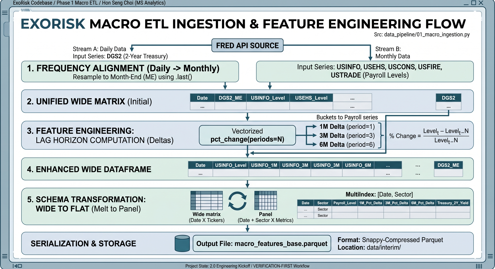
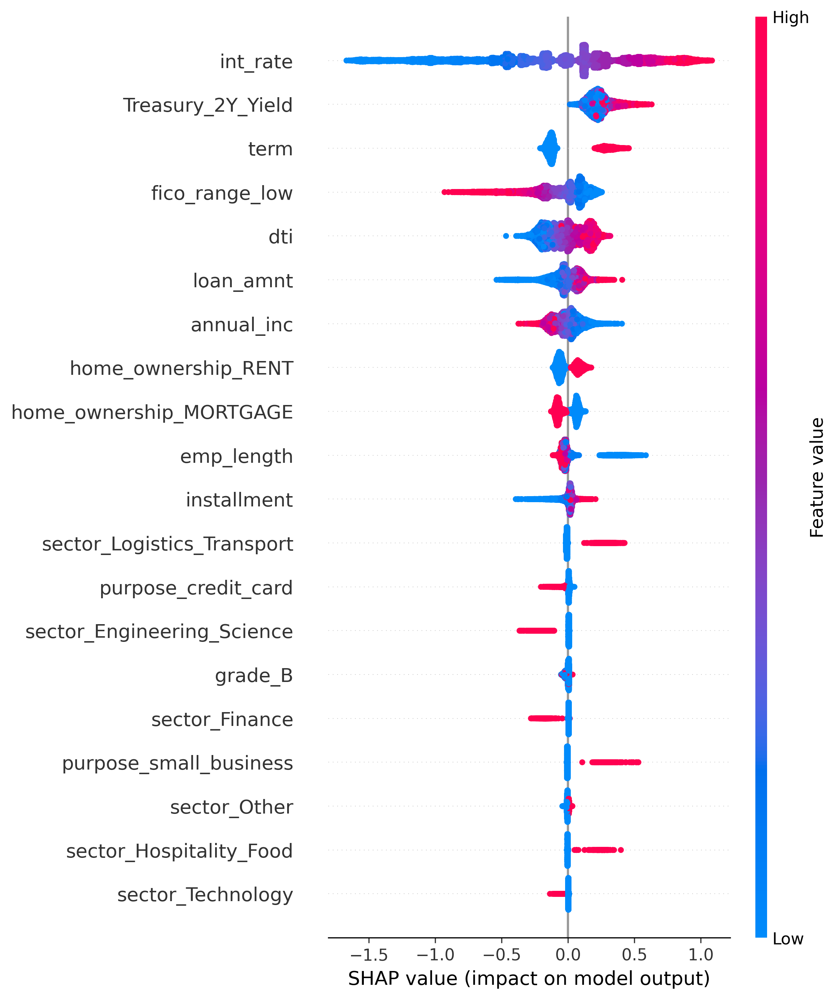
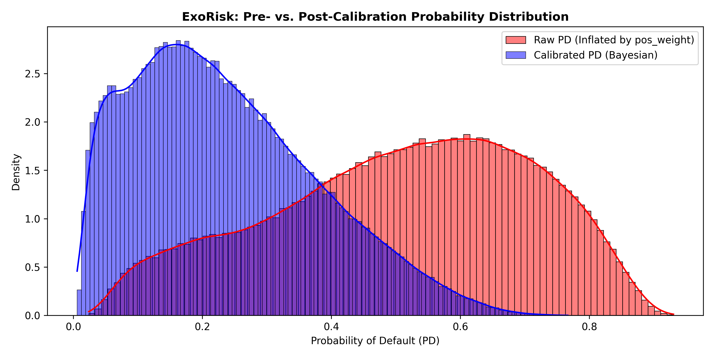

# ExoRisk: Isolating Sector Delta Risk in Consumer Credit

**Architect:** Hon Seng Choi | Principal Quantitative Architect
**Domain:** Macroeconomic Stress-Testing & Predictive Underwriting
**Live Demo:** [Insert Streamlit Link Here]
**GitHub Repository:** [Insert GitHub Link Here]

---

## 1. The Macroeconomic Thesis: The August NFP Divergence
Traditional consumer credit models rely heavily on idiosyncratic micro-features (FICO, DTI, Income). However, this static approach creates a massive blind spot during economic regime shifts. 

The August Nonfarm Payrolls (NFP) report exposed a severe divergence in the labor market: while Government and Healthcare sectors added jobs, the Information and Technology sectors experienced distinct contractions. A static underwriting model treats a $100k-earning Tech worker and a $100k-earning Healthcare worker as identical risks. **ExoRisk** was engineered to mathematically separate them.

By merging macroeconomic regime data with micro-level borrower tapes, ExoRisk calculates a dynamic Probability of Default (PD) that adjusts based on the exact economic environment at the moment of origination.

## 2. Architectural Anchor: The 2-Year Treasury Yield
Attempting to feed an ML engine dozens of independent macroeconomic indicators (CPI, GDP, Unemployment) introduces severe multi-collinearity and variance inflation. 

To ensure robust signal extraction, ExoRisk utilizes the **2-Year US Treasury Yield** as its singular systemic macro proxy. The 2-Year Yield inherently prices in Federal Reserve monetary policy, forward inflation expectations, and systemic liquidity. By holding the broader macro environment constant via the 2-Year Yield, the XGBoost engine is freed to isolate and price the pure idiosyncratic risk of specific employment sectors.

*(Exhibit 1: Macro ETL Architecture - Demonstrating the vectorized multi-index parquet assembly).*

## 3. Algorithmic Explainability & SHAP Discoveries
To satisfy SR 11-7 Model Risk Management (MRM) requirements, the black-box gradient boosting architecture was audited using Shapley Additive Explanations (TreeSHAP). The results validated the core macroeconomic thesis and revealed several latent credit dynamics.

**Key SHAP Findings:**
1.  **The Dominance of the Cost of Capital:** The 2-Year Treasury Yield emerged as the #2 most impactful feature globally, second only to the specific loan interest rate. 
2.  **Sector Delta Isolation:** Without being explicitly instructed, the model extracted the inherent stability of W-2 wage earners versus high-variance 1099 profiles. 
    *   *Risk Suppressors:* `Technology` and `Finance` sectors consistently generated negative SHAP values, acting as structural credit buffers.
    *   *Risk Amplifiers:* `Logistics`, `Retail`, and `Hospitality` generated positive SHAP values, driving default probabilities upward.
3.  **The Homeownership Credit Paradox:** The model autonomously identified a classic consumer credit reality: borrowers who own their homes outright (`OWN`) carry a statistically higher default probability than those with a `MORTGAGE`. While counter-intuitive to traditional scoring, a borrower who owns a home free-and-clear but requires a high-interest unsecured personal loan is often cash-poor (e.g., retirees on fixed incomes or those with inherited property but zero liquidity). Conversely, active mortgage holders have been recently vetted by Tier-1 banks, proving stable DTI and cash flow.

*(Exhibit 2: SHAP Summary Plot - Visualizing the global feature hierarchy and directional sector impact).*

## 4. Production Calibration & The Asymmetry Problem
In unsecured consumer lending, terminal outcomes are inherently skewed: roughly 80% of borrowers repay their loans, while approximately 20% default. 

To force the XGBoost gradient descent to split on minority default risk, cost-sensitive learning (`scale_pos_weight`) was applied, dynamically penalizing missed defaults ~4.08 times more severely than false alarms. While this optimization achieved an elite **0.7049 ROC-AUC** for global risk ranking, it introduced a critical operational hazard: **Margin Inflation.**

**The Risk of Raw Outputs in Production**
The penalty multiplier artificially inflates the model's log-odds margin. A near-prime borrower with a true default probability of 15% will be scored at roughly 42% by the raw model. If an automated credit desk relies on these raw scores, it will immediately decline creditworthy applicants, destroying prime loan volume and credit revenue.

**The Closed-Form Bayesian Remedy**
To make the engine production-ready for a live institutional underwriting desk, a closed-form Bayesian probability calibration layer was mathematically injected into the inference pipeline. By applying Bayes' rule to invert the artificial prior weight, the true odds ratio is restored:

$$P_{\text{calibrated}} = \frac{P_{\text{raw}}}{P_{\text{raw}} + w(1 - P_{\text{raw}})}$$

This transformation maintained the model's elite ranking power while compressing the Brier Score from an inflated 0.2477 down to an optimized **0.1538**, ensuring the Streamlit HUD outputs true, real-world portfolio probabilities.

*(Exhibit 3: Pre- vs. Post-Calibration Distribution).*
